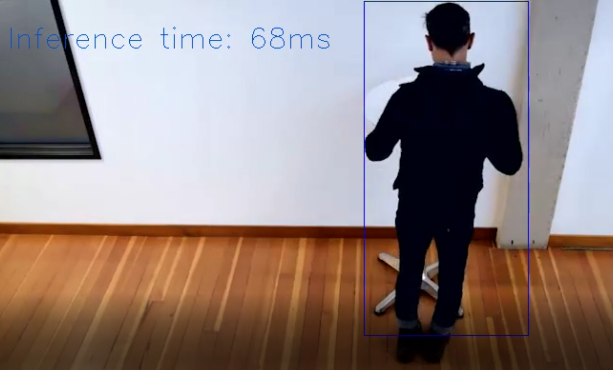
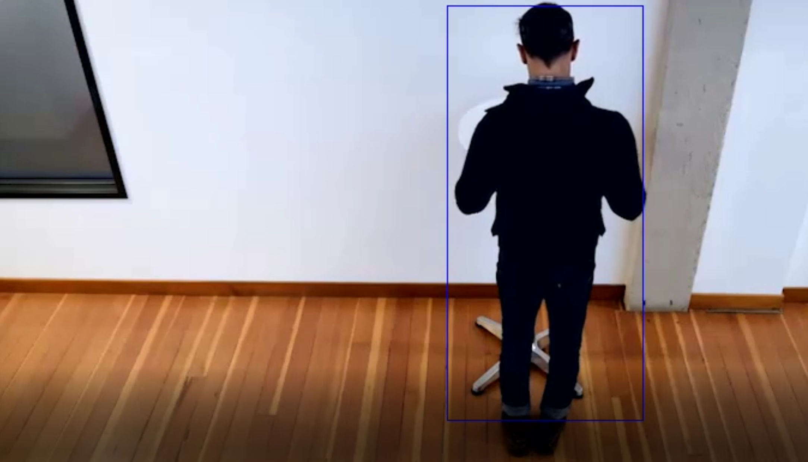

# Project Write-Up

This document provides steps wich were taken when the projects was implemented alongside the rationales for the steps. 

At a high level 3 models were tested for the application. Both SSD Mobile Net V1 & SSD Mobile Net V2 made inferences with good enough accuracy & latency. SSD Resnet 50 v1 FPN 640x640 on the other hand had very high latency. 

Commands used to run the app:
```
export EXTENSION=/opt/intel/openvino/deployment_tools/inference_engine/lib/intel64/

python main.py -m model/frozen_inference_graph.xml -i resources/Pedestrian_Detect_2_1_1.mp4 -l $EXTENSION/libcpu_extension_avx2.so -pt 0.05 | ffmpeg -v warning -f rawvideo -pixel_format bgr24 -video_size 768x432 -framerate 10 -i - http://0.0.0.0:3004/fac.ffm
```

## Explaining Custom Layers

Any layer not in the list of [supported layers](https://docs.openvinotoolkit.org/2019_R3/_docs_MO_DG_prepare_model_Supported_Frameworks_Layers.html) is defined as a custom layer by the model optimiser. Custom layers will not be natively supported by the inference engine & some additional steps are needed to make a model work with IR which has custom layers in it. With TensorFlow models there are 3 options to make such models work.
1. Register those layers as extensions to the Model Optimizer
2. Replace sub-graph in the model optimiser. [refere here](https://docs.openvinotoolkit.org/2019_R3/_docs_MO_DG_prepare_model_customize_model_optimizer_Subgraph_Replacement_Model_Optimizer.html)
3. Offload the computation of the subgraph back to TensorFlow during inference.

Handling custom layers are necessary when converting a model from the original framework (TF, Caffe) to IR. Some layers will not be supported & they would be needed to be process by above means.

During the implementation 3rd option was used. The absolut path for C++ library was given as an input argument to the app and it was added as an extension in the ```Network class```.

## Comparing Model Performance

In order to compare model performance, a sepate python script (tensorflow_test.py) was written to run the tensor flow model in on the same **Pedestrian_Detect_2_1_1.mp4** video & following parameters were calculated for both original TF model & converted IR model.
- inference time : Used inference execution times for each model
- accuracy : Number of frames detected with people in total frames of 1394
- model size : Taken from the directory model resides in

|Parameter|Tensorflow model | IR converted Model |
|---|---|---|
| inference time | 103 ms  | 67 ms|
| accuracy | 887  | 996 |
| model size  | 67M  | 65M |

note: ```tensorflow_test.py``` is added as a separate file in the workspace.
## Assess Model Use Cases

There can be many potential usecases of such a people counting app.
1. It can be used as a method of crowd control in a cofined place. This is useful to enforce social distancing during COVID-19 pandemic.
2. It can be used as a means of surveilance to check for un-authorised access. 
3. Counting and storing the people counts in a database can be use to do crowd analytics to identify when a certain place is highly populated & when it is not. 
4. The counting app can be scaled to run on the edge cameras & report the data back to a central server enabling smart cities to get insight on how the citizens use each of the public areas.

## Assess Effects on End User Needs

End user needs should be assessed before deciding on a model & implementing the app. This will make the application fit it purpose better. Some effects to consider would be,
- Model accuracy   
    A higher accuracy would mean the model will need more resources to run. If end user intends to run the app in a resource constrained env. accuracy might be affected.
- Model speed  
    Model speed referes to the inference time taken on each input. To speed up the inference it might be neccessary to sacrifice some of the accuracy. This should be discussed with the end user.
- Model size   
    Bigger models again tends to be resource heavy & might not fit in to a resource constrained environment.
- Lighting condition  
    This will impact the accuracy of the application if the model has not been trained on different kinds of lighting condtions. The end user needs to specify how the app would be used & a special model trainning might be neccessary if the model has not been trained for the specified scenario.
- Camera focal length & image size
    Image sizes might affect the network bandwidth which is used to transport the video. Camera focal length can affect the model accuracy. 


## Model Research

Following models were tried in order to identify a suitable candidate for the application.

- Model 1: [SSD Resnet 50 v1 FPN 640x640]
  - [Model Source](http://download.tensorflow.org/models/object_detection/ssd_resnet50_v1_fpn_shared_box_predictor_640x640_coco14_sync_2018_07_03.tar.gz)
  - Command & arguments used to convert the model to IR
    ```Bash
      python /opt/intel/openvino/deployment_tools/model_optimizer/mo_tf.py --input_model frozen_inference_graph.pb --reverse_input_channels --tensorflow_use_custom_operations_config/opt/intel/openvino/deployment_tools/model_optimizer/extensions/front/tf/ssd_v2_support.json --tensorflow_object_detection_api_pipeline_config pipeline.config
    ```
  - The model was insufficient for the app because it took a long time to do the inferrence. The average inference time for this was 2680ms.    
    

- Model 2: [SSD Mobile Net V1]
  - [Model Source](http://download.tensorflow.org/models/object_detection/ssd_mobilenet_v1_coco_2018_01_28.tar.gz)
  - Command & arguments used to convert the model to IR
    ```
    python /opt/intel/openvino/deployment_tools/model_optimizer/mo_tf.py --input_model frozen_inference_graph.pb --reverse_input_channels --tensorflow_use_custom_operations_config/opt/intel/openvino/deployment_tools/model_optimizer/extensions/front/tf/ssd_v2_support.json --tensorflow_object_detection_api_pipeline_config pipeline.config
    ```
  - The model performed well with average inference latency of 42 ms. It was able to recognise a person in 870 frames. But it missed the second person in the video from time to time. 

  - I tried to improve the model for the app by reducing the threshold to 0.05 & introducing a margin of error when frames are missed by the inference engine. 

- Model 3: [SSD Mobile Net V2]
  - [Model Source](http://download.tensorflow.org/models/object_detection/ssd_mobilenet_v2_coco_2018_03_29.tar.gz)
  - Command & arguments used to convert the model to IR
    ```
    python /opt/intel/openvino/deployment_tools/model_optimizer/mo_tf.py --input_model frozen_inference_graph.pb --reverse_input_channels --tensorflow_use_custom_operations_config/opt/intel/openvino/deployment_tools/model_optimizer/extensions/front/tf/ssd_v2_support.json --tensorflow_object_detection_api_pipeline_config pipeline.config
    ```
  - The model performed well with average inference latency of 67 ms. It was able to recognise a person in 996 frames. But it also missed the second person in the video from time to time. 
   
   |Correct result | Incorrect result - No inference time|
   |---|---|
   |   |   |
   |   |   |
   - I tried to improve the model for the app by reducing the threshold to 0.05 & introducing a margin of error when frames are missed by the inference engine. 

